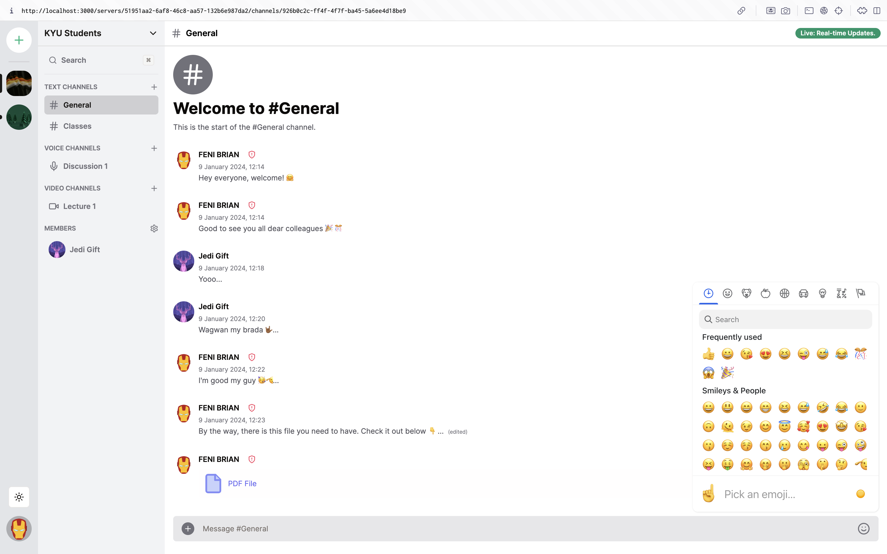

# Qiskord



-------------------------------------

## Introduction

Text messaging, voice calls, video calls, media and file sharing, and instant messaging are all possible on the **Qiskord** social messaging and VoIP platform. Private or public communication can occur in online groups known as "servers." A server is a group of voice channels and live chat rooms that are accessible through invite links. Users may also group themselves into topic-based channels for sharing and cooperation.

To sum up, **Qiskord** is the app where you may hang out with a small group of pals. A online hub that facilitates daily conversation and increased social interaction.

#### Technologies

This project makes use of the ground-breaking capabilities of the Next.js 14 App Router. It also allows for quick client-side routing, which makes the user experience more smooth and intuitive. In addition, the integration of Clerk allows for hassle-free user authentication as well as management.

### Prerequisites

**Node version 18.x.x**

### Install Packages

Choose the package manager of your choice; `npm i` or `yarn add`
~~~
    @clerk/nextjs
    @emoji-mart/data
    @emoji-mart/react
    @hookform/resolvers
    @livekit/components-react
    @livekit/components-styles
    @planetscale/database
    @prisma/client
    @tanstack/react-query
    @uploadthing/react
    axios
    class-variance-authority
    clsx
    cmdk
    date-fns
    dotenv
    emoji-mart
    livekit-client
    livekit-server-sdk
    lucide-react
    next
    next-themes
    query-string
    react
    react-dom
    react-dropzone
    react-hook-form
    socket.io
    socket.io-client
    tailwind-merge
    tailwindcss-animate
    uploadthing
    uuid
    zod
    zustand
~~~

#### Shadcn UI
For shadcn components, `npx shadcn-ui@latest add [component]` Replace \[component\] with the name of the ui component you wish to install.
Here's some examples used in the project:

| component     | description |
|:--------------|:------------|
|`avatar`        |An image element with a fallback for representing the user.|
|`button`        |Displays a button or a component that looks like a button.|
|`command`          |Fast, composable, unstyled command menu for React.|
|`dialog`        |A window overlaid on either the primary window or another dialog window, rendering the content underneath inert.|
|`dropdown-menu` |Displays a menu to the user — such as a set of actions or functions — triggered by a button.|
|`form`  |This component is a wrapper around the `react-hook-form` library that provides a few extra things such as composable components for building forms, a `<FormField />` component for building controlled form fields, form validation using `zod`, etc,.|
|`input`         |Displays a form input field or a component that looks like an input field.|
|`label`         |Renders an accessible label associated with controls.|
|`popover`        |Displays rich content in a portal, triggered by a button.|
|`scroll-area`     |Augments native scroll functionality for custom, cross-browser styling.|
|`select`     |Displays a list of options for the user to pick from—triggered by a button.|
|`separator`     |Visually or semantically separates content.|
|`sheet`     |Extends the Dialog component to display content that complements the main content of the screen.|
|`tooltip`     |A popup that displays information related to an element when the element receives keyboard focus or the mouse hovers over it.|

### Setup `.env` file

```
# Deployment used by `npx run dev`
NEXT_PUBLIC_CLERK_PUBLISHABLE_KEY=
NEXT_PUBLIC_CLERK_SIGN_IN_URL=/sign-in
NEXT_PUBLIC_CLERK_SIGN_UP_URL=/sign-up
NEXT_PUBLIC_CLERK_AFTER_SIGN_IN_URL=/
NEXT_PUBLIC_CLERK_AFTER_SIGN_UP_URL=/
CLERK_SECRET_KEY=

DATABASE_HOST=
DATABASE_USERNAME=
DATABASE_PASSWORD=
DATABASE_URL=

UPLOADTHING_SECRET=
UPLOADTHING_APP_ID=

LIVEKIT_API_KEY=
LIVEKIT_API_SECRET=
NEXT_PUBLIC_LIVEKIT_URL=

NEXT_PUBLIC_APP_URL="http://localhost:3000"
```

### Credits

All the credit 👏🏾 for this project goes to [Antonio Erdeljac](https://www.youtube.com/@codewithantonio) 🌟. He build the original project on which this was based. 
Watch and follow the step by step tutorial here [Youtube Tutorial](https://youtu.be/ZbX4Ok9YX94). Don't forget to leave a like and subscribe if you enjoy it. 
You can follow along with the code from the project's [Github Repo](https://github.com/AntonioErdeljac/next13-discord-clone.git) here. Leave a star if you wish.